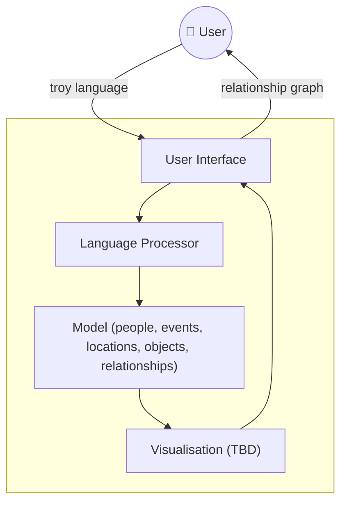

# Barnaby
> ⚠️ **Work in Progress — Experimental**
> This project is under active development and is highly experimental. It's not all there, there will be breaking changes and (very) rough edges. 

---

## About

**Barnaby** is a tool to help you keep track of *who is who* and *what is what* when watching TV crime series.

If you've ever found yourself halfway through a Nordic noir or a sprawling British detective drama, unsure whether that shady solicitor appeared in episode two or whether the detective's informant is the same person as the landlord's nephew — Barnaby is for you.

The tool lets you build up a personal reference of characters, relationships, locations, plot threads, and other details tied to a specific series, so you can query and update your notes as each episode unfolds. Think of it as a lightweight, local knowledge base for the dedicated crime drama viewer.

It is based on the [POLE](https://neo4j.com/blog/government/graph-technology-pole-position-law-enforcement/) model as used by actual police forces. However, if you're thinking of using this to solve real crime, then keep on dreaming!

Built in [Rust](https://www.rust-lang.org/), Barnaby is designed to be fast, offline, and entirely under your control.

---

## Software Architecture

> **Note:** The architecture diagram below reflects the current intended design and is subject to change as the project evolves.

### Component Overview

| Component | Description |
|---|---|
| **User Interface** | Entry point of the application. User can enter the plot so far using the TROY language | 
| **Language Processor** | Parses the users input (in the TROY language) and builds the model | 
| **Model** | Models the domain — characters, locations, plot threads, and their relationships. |
| **Visualisation** *tbd* | Displays the state of the story/model so far as a graph |

